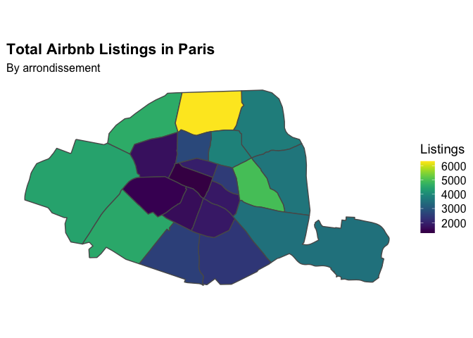
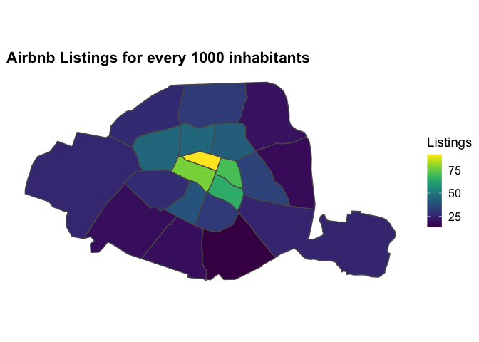
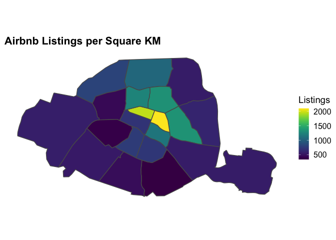

<!-- README.md is generated from README.Rmd. Please edit that file -->

# Airbnb Listings in Paris

<!-- badges: start -->
<!-- badges: end -->

I aggregate data from the Inside Airbnb initiative (see below) for over
50,000 individual listings in Paris to find the total number of listings
by *arrondissement* (i.e., district). In turn, I use webscraped data of
the population of each arrondissement to find the density of listings
for every 1000 people and by square kilometre. Lastly, I also find the
average nightly rate in each area, and plot all these aggregations in
interactive maps using `leaflet`.

## Data cleaning and wrangling

-   Load data from Inside Airbnb (one dataset for individual lisitings
    and one with the spatial coordinates of each arrondissement)

``` r
# Load data for individual listings from website
paris_listings <- fread(
  'http://data.insideairbnb.com/france/ile-de-france/paris/2022-09-09/visualisations/listings.csv')

# Read in shapefile of neighbourhoods and create sf object
paris_nhoods_geodata <- 
  st_read(here::here("data", "paris_neighbourhoods.nosync.geojson"), quiet = TRUE) %>% 
  # Get rid of unsused variables
  select(-neighbourhood_group)
```

-   Clean and aggregate data by *arrondissement*

``` r
# Get rid of dollar sign in price variable, and convert to numeric 
paris_listings$price <- as.integer(gsub("\\$", "", paris_listings$price))
```

-   Webscrape data for population and area of each arrondissement (will
    be used to find listings by population and by area)

``` r
# Read html address with arrondissements data from wikipedia (in italian)
wiki_paris_it <- 
  read_html("https://it.wikipedia.org/wiki/Arrondissement_municipali_di_Parigi")

## Scrape table with data for each arrondissement
paris_arronds_it <- wiki_paris_it %>% 
  html_element(".wikitable :nth-child(1)") %>%
  html_table() %>% 
  clean_names() %>% 
  select(arr, nome, superficie_ha, 
         popolazione_municipale_per_il_2010_e_2015_7, 
         densita_di_popolazione_abitanti_km2_7) %>% 
  slice(-c(1, 22, 23, 24)) %>% 
  mutate(nome = ifelse(nome == "Elyseo", "Élysée", nome),
         area_km2 = as.numeric(superficie_ha) / 100) %>% 
  rename(neighbourhood = nome,
         area_ha = superficie_ha,
         pop_2017 = popolazione_municipale_per_il_2010_e_2015_7,
         dens_2017 = densita_di_popolazione_abitanti_km2_7)
```

-   Merge aggregated listings data with webscraped data

``` r
# Merge aggregated listings data with arrondissements data
paris_arronds_full <- merge(paris_list_and_avgP_nhood, paris_arronds_it, 
                            by.x = "neighbourhood", by.y = "neighbourhood")
```

-   Create new variables for listings population and by area:
    -   Listings per 1000 inhabitants

    -   Listings per square kilometre

``` r
# Create new variables for listings and price by km2 and by population

## Calculate listings per 1000 people
  # Get rid of empty space in population column & convert variable to numeric class
paris_arronds_full$pop_2017 <- as.numeric(
  str_replace(paris_arronds_full$pop_2017,"\\s", ""))
  # Now create new variable for listings by population (and round new values)
paris_arronds_full %<>% 
  mutate(listings_by_pop = (n_listings)/(pop_2017)*1000, 
         listings_by_pop = round(listings_by_pop))


## Calculate listings per km2
paris_arronds_full %<>% mutate(listings_km2 = (n_listings)/(area_km2),
                               listings_km2 = round(listings_km2))
```

-   Merge aggregated data with geospatial data

``` r
# Merge geospatial data (sf object) with lyon airbnb listings data
paris_merged <- merge(paris_arronds_full, paris_nhoods_geodata, 
                      by.x = "neighbourhood", by.y = "neighbourhood")

# Convert new dataframe into an sf object
paris_merged_sf <- st_as_sf(paris_merged) #%>% st_transform(8857)
```

## Static Maps:

<!-- -->

<!-- -->

<!-- -->

## Interactive Plots

#### A) Total Airbnb Listings

#### B) Airbnb listings by population

#### C) Airbnb listings by square kilometer

#### D) Average airbnb price by arrondissement

## Data Source

The [data](http://insideairbnb.com/get-the-data) was sourced from the
[Inside Airbnb Project](http://insideairbnb.com/about/) which provides
webscraped data for Airbnb listings in cities throughout the globe. The
data for Paris was last scraped in June 2022.
